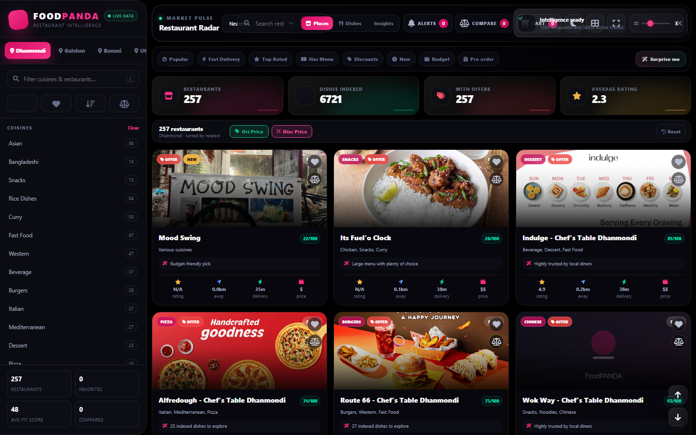
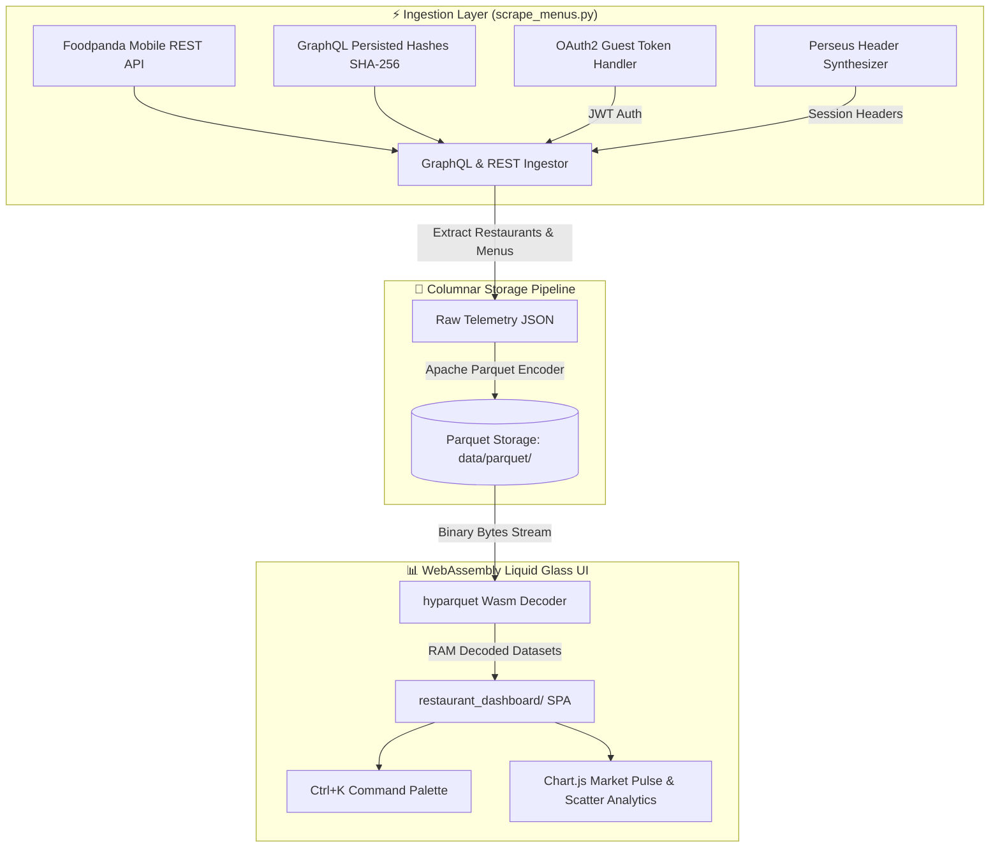

# 🐼 FoodPANDA — Restaurant Intelligence & Analytics Platform

> **GraphQL Persisted Operation Engine, Columnar Apache Parquet Storage Pipeline & Liquid Glassmorphism Analytics Suite for Foodpanda Bangladesh.**

[](https://python.org)
[](https://developer.mozilla.org/en-US/docs/Web/JavaScript)
[](https://parquet.apache.org)
[](https://github.com/hyparquet/hyparquet)
[](https://ranehal.github.io/FoodPANDA-RESTaurant-ANALytics/)
[](LICENSE)

---

## 📌 Executive Summary

**FoodPANDA Analytics** is an enterprise-grade food delivery intelligence platform and real-time analytics web application engineered to ingest, process, compress, and visualize restaurant, menu, and pricing telemetry across major commercial hubs in Metro Dhaka (Dhanmondi, Gulshan, Banani, Uttara, Mirpur).

Connecting directly to Foodpanda's REST APIs and GraphQL persisted operation endpoints, the pipeline processes full menu trees, compresses multi-megabyte payloads into **Apache Parquet columnar binary files**, and streams binary data directly into browser RAM using **in-browser WebAssembly decoding (`hyparquet`)** on a **Liquid Glassmorphism** dark mode UI.

---

## 🚀 Key Capabilities

- **🛰️ Dual-Tier REST & GraphQL Ingestion (`scrape_menus.py`)**:
  - Connects to `/offers-zone/api/v2/offers-zone` for multi-zone restaurant listings.
  - Queries GraphQL `RestaurantDetailsPage` using SHA-256 persisted operation hashes (`e54e2da...`) for complete menu extraction.
- **🔐 Automated OAuth2 & Perseus Session Lifecycle**: Implements client credentials token retrieval (`/api/v5/oauth2/token`) and emulates Perseus tracking session headers (`perseus-client-id`, `dps-session-id`).
- **⚡ High-Performance Columnar Compression**: Compresses raw ~81.7 MB JSON dataset payloads down to **~4.7 MB Apache Parquet files (~94% storage reduction)**.
- **🌐 WebAssembly (`hyparquet`) Browser Streaming**: Decodes columnar binary Parquet bytes directly inside browser RAM in milliseconds without requiring an active backend server.
- **💎 Liquid Glassmorphism Dark UI**: AMOLED pure black aesthetics with glowing glassmorphism panels, dynamic theme accents (`berry`, `cyan`, `violet`, `lime`), `Ctrl+K` Command Palette, and real-time Chart.js BI.

---

## 📸 Screenshots



---

## 🏗️ System Architecture



---

## 📁 Repository Structure

```
FoodPANDA/
├── scrape_menus.py                   # REST & GraphQL ingestion engine (httpx, OAuth2, Parquet)
├── debug_token.py                    # OAuth2 token authentication testing utility
├── run.bat                           # Windows batch execution script
├── foodpanda_26.28.0.apk             # Reference Android APK binary
├── index.html                        # Application entry point
├── data/                             # Data Storage Directory
│   └── parquet/                      # Compressed Apache Parquet binary datasets
└── restaurant_dashboard/             # Liquid Glassmorphism SPA Directory
    ├── index.html                    # Main web dashboard interface
    ├── app.js                        # Wasm hyparquet decoder, Chart.js BI, Command Palette
    └── styles.css                    # Liquid Glass UI & theme token stylesheet
```

---

## 🛠️ Usage & Quick Start

### 1. Execute Ingestion Scraper Engine
```bash
# Install required Python dependencies
pip install httpx pyarrow pandas

# Run GraphQL menu and restaurant scraper
python scrape_menus.py
```

### 2. Debug OAuth2 Authentication Handshake
```bash
# Verify guest JWT token retrieval
python debug_token.py
```

### 3. Launch Liquid Glass Analytics Dashboard
```bash
# Serve local web server
python -m http.server 8000
```
Open `http://localhost:8000/restaurant_dashboard` in your browser.

---

## 📜 License

Distributed under the MIT License. Trademarks and data belong to Foodpanda / Delivery Hero. Built for educational and analytics research.

---

## 🚀 Future Work & Industrial Roadmap

To elevate this platform to an enterprise-grade, production-ready product meeting current industrial standards, the following strategic goals and architecture enhancements are planned:

### 1. 🏗️ High-Availability Microservices & Infrastructure
- **Containerization & Orchestration**: Package ingestion workers, APIs, and dashboards into Docker containers with deployment via **Kubernetes (K8s)** and Helm charts for autoscaling during peak traffic hours.
- **Distributed Ingestion Workers**: Transition from localized scraping scripts to an asynchronous, fault-tolerant worker pool utilizing **Celery + Redis** or **Temporal.io** with automated proxy rotation, rate-limiting retry strategies, and CAPTCHA bypass capabilities.
- **High-Performance API Gateway**: Implement an enterprise API Gateway (Kong / Envoy) providing OAuth2 / JWT authentication, TLS termination, and granular rate limiting (Token Bucket algorithm).

### 2. 📊 Enterprise Data Engineering & Streaming Pipelines
- **Data Lakehouse Architecture**: Store multi-year raw price histories using **Apache Parquet / Delta Lake** or **Google BigQuery** for scalable analytical queries across millions of SKU updates.
- **Real-Time CDC & Message Streaming**: Integrate **Apache Kafka** or **NATS** for Change Data Capture (CDC) to stream price change events instantly to downstream analytics and notification consumers.
- **Automated Workflow Orchestration**: Schedule and monitor data ingestion, ETL pipelines, and unit normalization using **Apache Airflow** or **Prefect** integrated with **dbt** for dynamic data transformations.

### 3. 🧠 Machine Learning & Advanced Market Intelligence
- **Predictive Price Forecasting**: Deploy **Prophet** and **LSTM Neural Networks** to predict future price drops, historical promotion trends, and seasonal discount cycles.
- **Anomaly & Surge Detection**: Build ML models to identify artificial price hikes before promotional sales, mislabeled unit metrics, and phantom stock availability.
- **Semantic Product Entity Matching**: Utilize vector embeddings (OpenAI / Sentence-Transformers) paired with **pgvector** / **Pinecone** to match identical SKUs across competitor platforms despite variations in naming formats.

### 4. 🔐 Security, Compliance & System Observability
- **Zero-Trust Security & RBAC**: Enforce Role-Based Access Control (RBAC), AES-256 GCM payload encryption at rest, and secret rotation via HashiCorp Vault.
- **Full Observability Stack**: Instrument services with **OpenTelemetry**, emitting distributed traces, Prometheus metrics, and structured logs to **Grafana Loki & Tempo** dashboards.
- **SLA Alerting & Webhook Engine**: Provide instant trigger notifications via **Telegram Bot API**, **Discord Webhooks**, email notifications, and enterprise SMS gateways when watched items reach target prices.

### 5. 📱 Next-Gen User Experience & Mobile Platforms
- **Cross-Platform Mobile App**: Develop a dedicated **React Native / Flutter** app featuring push notifications for price drops, barcode scanning in physical stores, and personalized deal watchlists.
- **Progressive Web App (PWA)**: Upgrade the dashboard to a full PWA with offline caching via Service Workers, dynamic theme switching, and desktop application installability.
