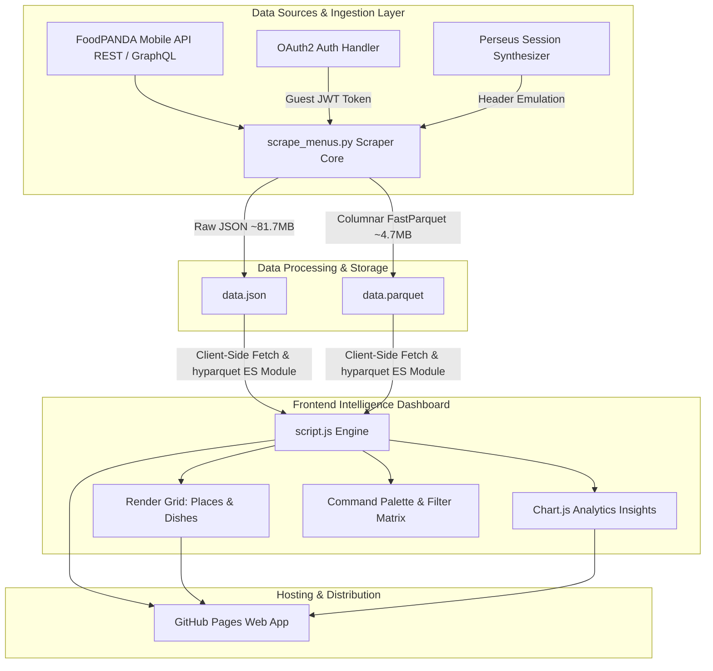

# 🐼 FoodPANDA — Restaurant Intelligence & Analytics Platform

[](https://python.org)
[](https://developer.mozilla.org/en-US/docs/Web/JavaScript)
[](https://parquet.apache.org)
[](https://www.chartjs.org)
[](https://ranehal.github.io/FoodPANDA-RESTaurant-ANALytics/)
[](LICENSE)

An end-to-end food delivery intelligence platform and real-time analytics web dashboard engineered to reverse engineer, ingest, process, and visualize restaurant, menu, and pricing telemetry across major commercial hubs (Dhanmondi, Gulshan, Banani, Uttara, Mirpur).

---

## 🌐 Live Interactive Demo

Access the live dashboard directly hosted via GitHub Pages:  
👉 **[https://ranehal.github.io/FoodPANDA-RESTaurant-ANALytics/](https://ranehal.github.io/FoodPANDA-RESTaurant-ANALytics/)**

---

## 🌟 Key Capabilities

### 🛰️ Live Ingestion & GraphQL Scraper Engine
- **REST & GraphQL Dual-Tier Ingestion**: Connects directly to Foodpanda's `/offers-zone/api/v2/offers-zone` endpoint for multi-zone restaurant listings and uses GraphQL `RestaurantDetailsPage` queries with persisted SHA-256 operation hashes (`e54e2da...`) for complete menu extraction.
- **Automated OAuth2 Session Lifecycle**: Implements full client credentials token fetching (`/api/v5/oauth2/token`), Perseus session header synthesis (`perseus-client-id`, `perseus-session-id`, `dps-session-id`), and auto-refreshing error handlers on HTTP 401 Unauthorized states.
- **Robust Failure Resilience**: Built-in exponential backoff, connection reset recovery, HTTP/2 multiplexing via `httpx`, and incremental disk flushing every 30 restaurants to prevent telemetry loss.

### ⚡ High-Performance Columnar Data Pipeline
- **Apache Parquet Compression**: Compresses raw ~81.7 MB JSON dataset payloads down to ~4.7 MB Apache Parquet files (~94% storage reduction).
- **In-Browser WebAssembly / ES Module Decoding**: Utilizes `hyparquet` to load and stream columnar binary Parquet bytes client-side directly into browser RAM in milliseconds, with transparent fallback to JSON when required.

### 💎 Liquid Glass Dashboard & Visual Design System
- **Modern Dark UI**: Engineered with custom CSS variables featuring AMOLED pure black backgrounds, glowing translucent glassmorphism panels, and dynamic accent theme switching (`berry`, `cyan`, `violet`, `lime`).
- **Unified Market Pulse**: Seamless switching between **Places** (Restaurant Grid), **Dishes** (Menu Catalog), and **Insights** (Interactive BI Analytics).
- **Real-Time Interactive BI**: Chart.js charts providing cuisine distribution breakdown, rating vs. price correlation scatter plots, price tier distribution, and delivery speed histograms.
- **Command Palette & Keyboard Accessibility**: Includes `Ctrl+K` modal command palette, `/` instant search activation, multi-item comparison matrix, price drop/rise sorting, and favorite bookmarking stored in `localStorage`.

---

## 🏗️ System Architecture



---

## 📁 Repository Structure

```directory
FoodPANDA-RESTaurant-ANALytics/
├── index.html                      # Root redirect for GitHub Pages deployment
├── .nojekyll                       # Bypass Jekyll asset processing on GitHub Pages
├── scrape_menus.py                 # Multi-threaded REST/GraphQL Foodpanda scraper
├── debug_token.py                  # Token generator & API diagnostic utility
├── run.bat                         # Interactive Windows launcher CLI
├── data/
│   └── token.txt                   # Cached OAuth2 JWT guest token
├── restaurant_dashboard/
│   ├── index.html                  # Dashboard HTML5 container & controls
│   ├── script.js                   # Application logic, Parquet decoder & Chart.js engine
│   ├── style.css                   # Liquid Glass design system & theme tokens
│   ├── data.parquet                # Compressed columnar dataset (4.7 MB)
│   └── data.json                   # JSON dataset backup
└── README.md                       # Comprehensive technical documentation
```

---

## 🚀 Quick Start Guide

### Prerequisites
- **Python 3.9+**
- Python Dependencies: `httpx`, `fastparquet`, `pyarrow` (optional for local parquet export)

```bash
pip install httpx fastparquet pyarrow
```

### 1. Clone the Repository
```bash
git clone https://github.com/ranehal/FoodPANDA-RESTaurant-ANALytics.git
cd FoodPANDA-RESTaurant-ANALytics
```

### 2. Run via Interactive Launcher (Windows)
Double-click `run.bat` or launch via terminal:
```cmd
.\run.bat
```
The menu offers 4 operational modes:
1. `[1]` **Run Scraper**: Executes `scrape_menus.py` to pull fresh data.
2. `[2]` **Start Dashboard**: Launches local HTTP server on `http://localhost:8081`.
3. `[3]` **Run Scraper + Dashboard**: Scrapes latest data and boots the dashboard.
4. `[4]` **Scrape + Dashboard (Auto-Open)**: Scrapes, boots server, and automatically opens browser.

### 3. Run Manually via CLI

#### Scrape Live Telemetry:
```bash
python scrape_menus.py
```
*Optional Flags*:
- `--limit N`: Limit restaurants per zone to `N`.
- `--skip-details`: Skip menu detail fetching to quickly refresh restaurant metadata.
- `--token YOUR_TOKEN`: Override guest OAuth token.

#### Launch Local Web Dashboard:
```bash
cd restaurant_dashboard
python -m http.server 8081
```
Open **`http://localhost:8081`** in your browser.

---

## 📊 Telemetry & Data Schema

Each ingested location contains a collection of restaurant metadata and dishes structured as follows:

| Field | Type | Description |
| :--- | :--- | :--- |
| `code` | `string` | Unique Foodpanda vendor code slug |
| `name` | `string` | Restaurant commercial title |
| `primaryCuisine` | `string` | Primary cuisine classification |
| `rating` | `float` | Customer review score (0.0 – 5.0) |
| `reviewCount` | `int` | Total customer ratings count |
| `deliveryTime` | `int` | Minimum delivery ETA (minutes) |
| `deliveryFee` | `float` | Base delivery fee (BDT) |
| `budget` | `int` | Price tier indicator (1 = $, 2 = $$, 3 = $$$) |
| `menus` | `array` | Category-indexed list of menu items with prices & discounts |

---

## 🌐 Deploying to GitHub Pages

This project is fully static and zero-backend dependent.

1. Go to your GitHub repository: `https://github.com/ranehal/FoodPANDA-RESTaurant-ANALytics`
2. Navigate to **Settings** > **Pages**.
3. Under **Build and deployment**:
   - **Source**: Select `Deploy from a branch`
   - **Branch**: Choose `main` / `root` directory `/`
4. Click **Save**. The website will be live at `https://ranehal.github.io/FoodPANDA-RESTaurant-ANALytics/`.

---

## 🛠️ Tech Stack & Dependencies

- **Scraper Core**: Python 3.9+, HTTPX (HTTP/2 enabled), JSON, Argparse
- **Storage / Compression**: Apache Parquet (`fastparquet` / `pyarrow`)
- **Frontend Framework**: Vanilla JavaScript (ES Modules, Async/Await), HTML5, CSS3 Glassmorphism
- **Parquet Web Engine**: `hyparquet` ES Module via CDN
- **Visual Analytics**: Chart.js v4, FontAwesome 6 Icons
- **Web Server**: Python `http.server` / GitHub Pages

---

## 📜 License & Copyright

Distributed under the **MIT License**. Created by [ranehal](https://github.com/ranehal).

```
Copyright (a) 2026 ranehal
```
