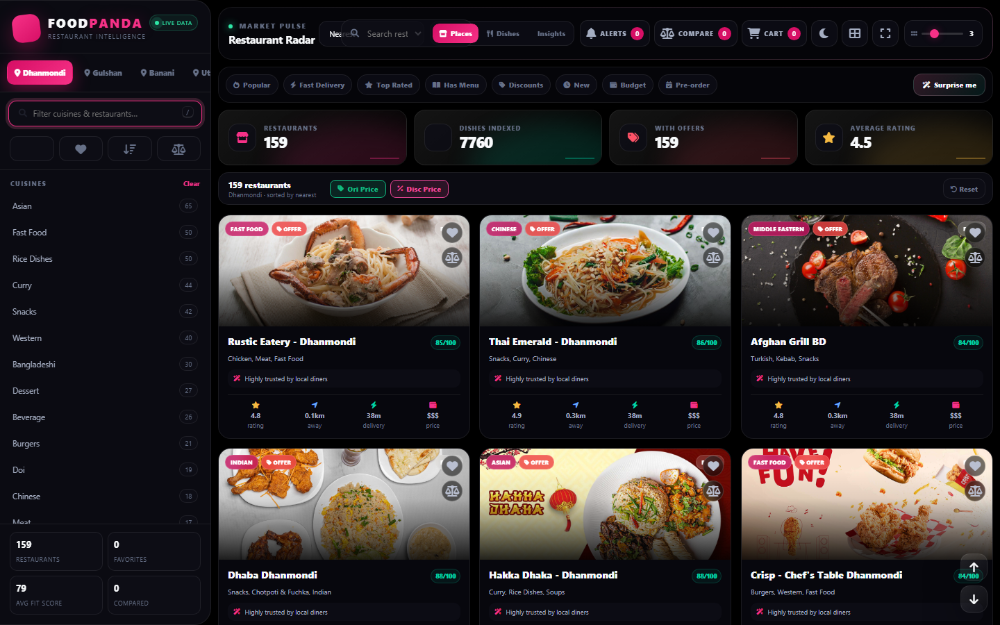
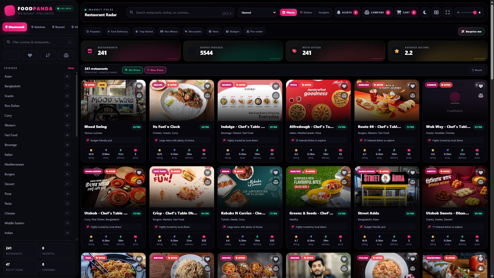

# FoodPANDA Restaurant Analytics — Menu Price Intelligence

Foodpanda restaurant menu scraper, item history tracker, and parquet data pipeline.

---

## 🌐 Dashboard & Live Preview


---

## 📈 Price History & Historical Analytics



---

## 🔍 Features & Interactive Exploration



---

## 🛠️ Features & Architecture

- **Automated Price Tracking**: Scrapes live catalog prices and logs historical deltas across 34 daily snapshots (2026-07-27 to 2026-08-31).
- **158,000+ Dishes Monitored**: Tracks 147,000+ multi-day price trajectories across 3,800+ restaurants in Dhaka (Dhanmondi, Gulshan, Banani, Uttara, Mirpur).
- **Fast Interactive UI**: Clean, responsive liquid-glass dashboard with search, filters, category views, and interactive multi-week price history charts.
- **High Efficiency Storage**: 180MB+ raw dataset compressed into a high-performance 6MB Parquet file using zstd-19 compression for instant browser loading via WebAssembly (`hyparquet`).

## ⚡ Local Run Instructions

```bash
# Run the scraper entry point
python scrape_menus.py

# Serve dashboard locally
python -m http.server 8000
```

